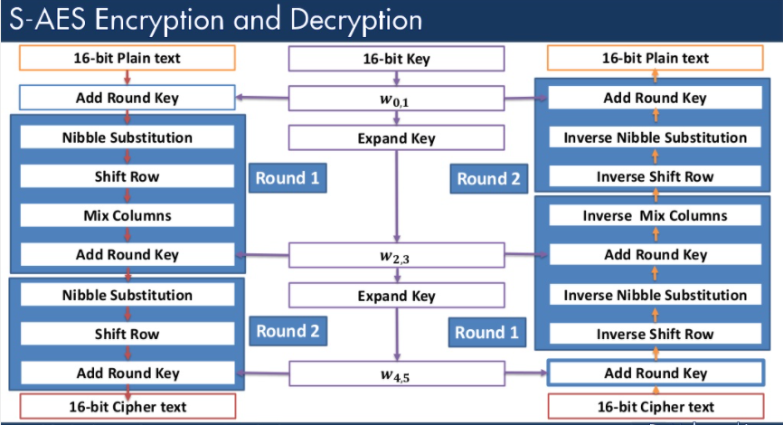

# Simplified AES Implementation

This is a scoket program in which the client encrypts a message using given key and the converted ciphertext message gets passed to the server (on the same pc(network)) and then Server receive the encrypted message and the key. The Server then perfom decryption operation on the received encrypted message using the key.

>Note: __Simplified__ AES has been used for Encryption and Decryption.

***

***
The program contains 3 files: **Main.py**, **Client.py**, and **Server.py**.
***

## **Main.py**
This file contains all the functions and varibles that is required for encrypting and decrypting the message.



**Main.py** contains all the functions that is shown in the image above.

There are 2 rounds for Encryption and Decryption to be performed as we can see in the image.

Check **Main.py** to see all the functions.
Functions used in **Main.py**:-
1. encrypt [to encrypt the message]
2. decrypt [to decrypt the message]
3. keyExp [to Generate the three round keys]
4. shiftRow [to Shift Row]
5. sub4NibList [for Nibble substitution]
6. addKey [to Add Round Key]
7. vecToInt [to convert matrix into a single int value]
8. intToVec [Forming 2x2 matrix from int value]
9. conv_to_hexa [to convert the integer into hexadecimal]
10. mixCol [mix the column of 2x2 matrix using the constant matrix]
11. iMixCol [inverse of mixCol]

## **Client.py** 

We import the required function from **Main.py** for the encryption of the message in this file.


We first takes input for message and key. Then call *Keyexp* function to generate keys on the client side. If the message is not of even length then we append 'z' to the message as a last character. Now we run a loop on the message and take 2 character at a time, *encrypt* it and then store it in a varable *ciphertext_list*.

*ciphertext_list* now contains the list of encypted messages.

Now Client sends *ciphertext_list* and *key* to the Server. 


## **Server.py**

The Server receives the list of ciphertext messages and the key. Now again we call *Keyexp* function to generate keys on the Server side also(keys generated are same as on the client sode). Then we call *decrpyt* function to decrypt the encrypted message from the *ciphertext_list* and store it in a variable *plaintext_list*.

>NOTE: All the values printed on the terminal on running the program will be in hexadecimal form.


## Run
cd to the directory of code.
```
python Server.py
python Client.py
```